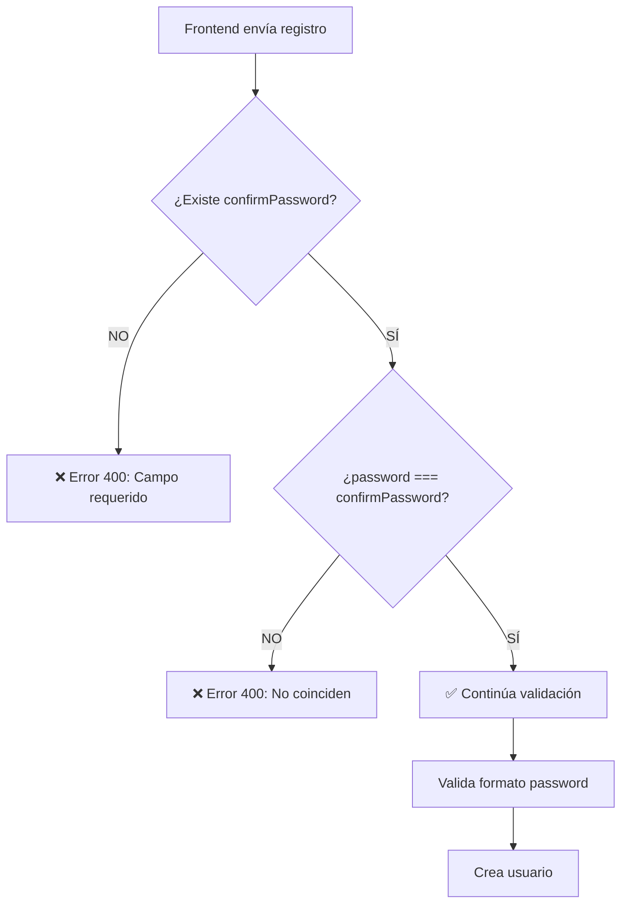

# 🔐 **CONFIRMACIÓN DE CONTRASEÑA - ESPECIFICACIÓN TÉCNICA PARA FRONTEND**

## 🎯 **Resumen Ejecutivo**

**SÍ, el campo `confirmPassword` es OBLIGATORIO** para el registro de usuarios según la arquitectura del backend. Este documento explica por qué es necesario y cómo implementarlo correctamente.

---

## 🏗️ **ARQUITECTURA DEL BACKEND**

### **📋 Validación en Capas**

El backend implementa **validación en múltiples capas** para garantizar la seguridad:

```typescript
// 1️⃣ VALIDACIÓN EN CONTROLADOR (userController.ts)
const { username, email, password, confirmPassword, firstName, lastName, age } = req.body;

// Validación de campos requeridos
if (!email || !password || !confirmPassword || !firstName || !lastName || !age) {
  return res.status(400).json({
    success: false,
    message: 'Email, contraseña, nombre, apellido y edad son requeridos'
  });
}

// 2️⃣ VALIDACIÓN DE COINCIDENCIA DE CONTRASEÑAS
if (password !== confirmPassword) {
  return res.status(400).json({
    success: false,
    message: 'Las contraseñas no coinciden'
  });
}
```

---

## 🔒 **¿POR QUÉ ES OBLIGATORIO `confirmPassword`?**

### **1. 🛡️ Seguridad del Usuario**
- **Previene errores de tipeo** en contraseñas
- **Confirma intención del usuario** antes de crear cuenta
- **Evita accounts con contraseñas incorrectas** por error

### **2. 🏗️ Arquitectura de Validación**
```typescript
// El controlador ESPERA este campo
const { password, confirmPassword } = req.body;

// Sin confirmPassword → Error 400
if (!confirmPassword) {
  // BAD_REQUEST: Campo requerido faltante
}

// Con confirmPassword pero no coincide → Error 400  
if (password !== confirmPassword) {
  // BAD_REQUEST: Las contraseñas no coinciden
}
```

### **3. 📊 Flujo de Validación Completo**


---

## 📤 **ESPECIFICACIÓN TÉCNICA**

### **📋 Request Body COMPLETO**
```typescript
interface RegisterUserRequest {
  // CAMPOS OBLIGATORIOS
  email: string;           
  password: string;        
  confirmPassword: string; // ← ¡OBLIGATORIO!
  firstName: string;       
  lastName: string;        
  age: number;            
  
  // CAMPOS OPCIONALES
  username?: string;       
}
```

### **✅ Ejemplo de Petición Correcta**
```javascript
{
  "email": "usuario@example.com",
  "password": "MiPassword123!",
  "confirmPassword": "MiPassword123!",  // ← DEBE SER IGUAL A password
  "firstName": "Juan",
  "lastName": "Pérez",
  "age": 25
}
```

### **❌ Ejemplos de Peticiones INCORRECTAS**

#### **Error 1: Falta confirmPassword**
```javascript
// ❌ INCORRECTO - Falta confirmPassword
{
  "email": "usuario@example.com",
  "password": "MiPassword123!",
  // confirmPassword: FALTANTE
  "firstName": "Juan", 
  "lastName": "Pérez",
  "age": 25
}

// Respuesta del backend:
{
  "success": false,
  "message": "Email, contraseña, nombre, apellido y edad son requeridos",
  "timestamp": "2024-10-17T00:00:00.000Z"
}
```

#### **Error 2: Contraseñas no coinciden**
```javascript
// ❌ INCORRECTO - Contraseñas diferentes
{
  "email": "usuario@example.com",
  "password": "MiPassword123!",
  "confirmPassword": "DiferentePassword456!",  // ← NO COINCIDE
  "firstName": "Juan",
  "lastName": "Pérez", 
  "age": 25
}

// Respuesta del backend:
{
  "success": false,
  "message": "Las contraseñas no coinciden",
  "timestamp": "2024-10-17T00:00:00.000Z"
}
```

---

## 🛠️ **IMPLEMENTACIÓN PARA FRONTEND**

### **1. 📝 Formulario HTML**
```html
<form>
  <input name="email" type="email" required />
  <input name="password" type="password" required />
  <input name="confirmPassword" type="password" required />  <!-- ← OBLIGATORIO -->
  <input name="firstName" type="text" required />
  <input name="lastName" type="text" required />
  <input name="age" type="number" required />
  <button type="submit">Registrarse</button>
</form>
```

### **2. 🔍 Validación Client-Side (Recomendada)**
```javascript
const validateRegistrationForm = (formData) => {
  const errors = {};

  // Validar que confirmPassword existe
  if (!formData.confirmPassword) {
    errors.confirmPassword = 'Confirmación de contraseña es requerida';
  }

  // Validar que las contraseñas coinciden
  if (formData.password !== formData.confirmPassword) {
    errors.confirmPassword = 'Las contraseñas no coinciden';
  }

  // Validar fortaleza de contraseña
  const passwordRegex = /^(?=.*[a-z])(?=.*[A-Z])(?=.*\d)(?=.*[@$!%*?&])[A-Za-z\d@$!%*?&]{8,}$/;
  if (!passwordRegex.test(formData.password)) {
    errors.password = 'Password debe tener mayúscula, minúscula, número y símbolo especial';
  }

  return { isValid: Object.keys(errors).length === 0, errors };
};
```

### **3. 📤 Envío de Datos**
```javascript
const registerUser = async (formData) => {
  // IMPORTANTE: Incluir confirmPassword en el payload
  const payload = {
    email: formData.email.trim().toLowerCase(),
    password: formData.password,
    confirmPassword: formData.confirmPassword,  // ← OBLIGATORIO
    firstName: formData.firstName.trim(),
    lastName: formData.lastName.trim(),
    age: parseInt(formData.age, 10)
  };

  const response = await fetch(`${API_BASE_URL}/api/auth/register`, {
    method: 'POST',
    headers: {
      'Content-Type': 'application/json',
      'Accept': 'application/json'
    },
    body: JSON.stringify(payload)
  });

  return await response.json();
};
```

---

## 🚨 **ERRORES COMUNES A EVITAR**

### ❌ **Error 1: No enviar confirmPassword**
```javascript
// INCORRECTO ❌
const payload = {
  email: "test@email.com",
  password: "Password123!",
  // confirmPassword: FALTANTE ← Error 400
  firstName: "Test",
  lastName: "User",
  age: 25
};
```

### ❌ **Error 2: Enviar confirmPassword vacío**
```javascript
// INCORRECTO ❌
const payload = {
  email: "test@email.com", 
  password: "Password123!",
  confirmPassword: "",     // ← Vacío = Error 400
  firstName: "Test",
  lastName: "User",
  age: 25
};
```

### ❌ **Error 3: Contraseñas que no coinciden**
```javascript
// INCORRECTO ❌
const payload = {
  email: "test@email.com",
  password: "Password123!",
  confirmPassword: "DifferentPass456!",  // ← No coincide = Error 400
  firstName: "Test", 
  lastName: "User",
  age: 25
};
```

---

## 📊 **RESPUESTAS DEL SERVIDOR**

### **✅ Registro Exitoso (201)**
```json
{
  "success": true,
  "message": "Registro exitoso",
  "data": {
    "user": {
      "id": "6a1b2c3d4e5f6789",
      "username": "testuser",
      "email": "test@email.com",
      "firstName": "Test",
      "lastName": "User",
      "age": 25,
      "role": "user"
    }
  },
  "timestamp": "2024-10-17T00:00:00.000Z"
}
```

### **❌ Error: Falta confirmPassword (400)**
```json
{
  "success": false,
  "message": "Email, contraseña, nombre, apellido y edad son requeridos",
  "timestamp": "2024-10-17T00:00:00.000Z"
}
```

### **❌ Error: Contraseñas no coinciden (400)**
```json
{
  "success": false,
  "message": "Las contraseñas no coinciden", 
  "timestamp": "2024-10-17T00:00:00.000Z"
}
```

---

## 🔧 **DEBUGGING Y TESTING**

### **1. 🧪 Test Cases para Frontend**
```javascript
// TEST 1: Registro exitoso
const testSuccessfulRegistration = () => {
  const payload = {
    email: "test@email.com",
    password: "Password123!",
    confirmPassword: "Password123!",  // ← Coincide
    firstName: "Test",
    lastName: "User", 
    age: 25
  };
  // Debe retornar status 201
};

// TEST 2: confirmPassword faltante
const testMissingConfirmPassword = () => {
  const payload = {
    email: "test@email.com",
    password: "Password123!",
    // confirmPassword: undefined
    firstName: "Test",
    lastName: "User",
    age: 25
  };
  // Debe retornar status 400 
};

// TEST 3: Contraseñas no coinciden
const testPasswordMismatch = () => {
  const payload = {
    email: "test@email.com", 
    password: "Password123!",
    confirmPassword: "DifferentPass456!",
    firstName: "Test",
    lastName: "User",
    age: 25
  };
  // Debe retornar status 400
};
```

### **2. 🔍 Verificación en DevTools**
```javascript
// En Network tab, verificar el Request Payload:
{
  "email": "test@email.com",
  "password": "Password123!",
  "confirmPassword": "Password123!",  // ← DEBE ESTAR PRESENTE
  "firstName": "Test",
  "lastName": "User",
  "age": 25
}
```

---

## 📋 **CHECKLIST PARA FRONTEND**

Antes de implementar el registro, verificar:

- [ ] ✅ Formulario incluye campo `confirmPassword`
- [ ] ✅ Validación client-side: password === confirmPassword  
- [ ] ✅ Payload incluye `confirmPassword` en el JSON
- [ ] ✅ Manejo de error 400 "Las contraseñas no coinciden"
- [ ] ✅ Validación de fortaleza de contraseña en ambos campos
- [ ] ✅ UX: Mostrar error si las contraseñas no coinciden en tiempo real

---

## 🎯 **RESUMEN EJECUTIVO**

### **¿Es obligatorio confirmPassword?**
**✅ SÍ, es completamente obligatorio**

### **¿Por qué?**
1. **Seguridad**: Previene errores de tipeo
2. **Arquitectura**: El controlador lo requiere explícitamente  
3. **UX**: Confirma la intención del usuario

### **¿Qué pasa si no lo envío?**
**❌ Error 400: "Email, contraseña, nombre, apellido y edad son requeridos"**

### **¿Qué pasa si no coinciden?**
**❌ Error 400: "Las contraseñas no coinciden"**

---

## 📞 **CONTACTO TÉCNICO**

Si tienes dudas sobre la implementación:

1. **Revisar el controlador**: `src/controllers/userController.ts` línea 67-72
2. **Verificar payload** en DevTools Network tab
3. **Comprobar respuesta del servidor** para errores específicos

**Backend Repository**: https://github.com/Unyfilm/PI-MP--2-BACK
**Endpoint**: `POST /api/auth/register`

---

**Documento generado**: Octubre 17, 2025  
**Versión del Backend**: v2.1.0 (Username Opcional + confirmPassword Obligatorio)